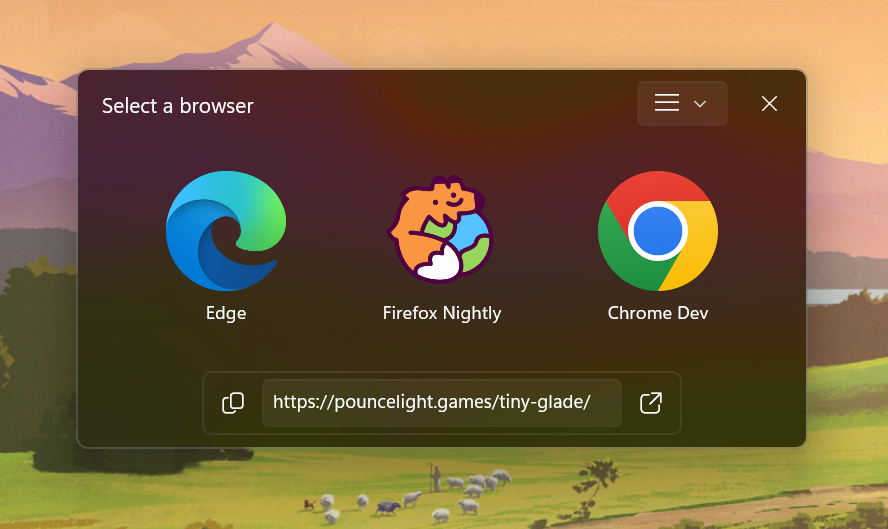

  
  
  <h1>Quiver</h1>
  
  
A windows utility that lets you choose a browser on the click of a link

  
  

    
    
    
    
  

> [!NOTE]
> This software is currently in pre-v1.0 version, which means it can frequently introduce breaking changes with new versions.

## Why and what?

Sometimes you might want to open a link in a browser of your choice, instead of the default one. Quiver lets you choose the browser each time you click a link (links outside of browsers). So naturally, it acts as default browser to do that.

- A radial browser picker that opens under the mouse cursor, with acrylic petals and number-key shortcuts
- Supports adding custom browser configuration with Launch Arguments
- Rules to automatically open a browser without prompting
- Settings window to manage all the features
- Quickly view URLs by launching them into a WebView2 window or your preferred browser with a shortcut (experimental)
- A Web Extension to open browser tabs in Quiver (experimental)

  

## Installation and usage

Install Quiver from the Microsoft Store. Updates are delivered through the Store.

After installing, make sure to set Quiver as the default `http/https` protocol handler aka as the default browser in the Windows Settings. In Windows 11: **Settings** > **Apps** > **Default apps** > **Quiver** (set `http`, `https`, `.html`, `.htm` and `.pdf`).

Open settings from the tray icon menu, or right-click **Quiver** in Start or on the taskbar and pick **Quiver Settings**. From a terminal, the `quiver` alias works too, e.g. `quiver --settings`.

Vist to [Docs](./Docs/README.md) for more details on usage and configuration.
See [Extensions readme](./Extensions/README.md) for installing the Browser Extension.

## Building from source / local development

Requirements:

- [Visual Studio 2026](https://visualstudio.microsoft.com/downloads/) with the WinUI application development workload (for debugging)
- [.NET 10 SDK](https://dotnet.microsoft.com/download)
- Windows SDK 10.0.26100
- Rust via [rustup](https://www.rust-lang.org/tools/install), with the MSVC build tools (x64 and ARM64 MSVC components)

Run `./build.ps1` from the repo root. It builds the Rust NativeMessagingHost for each architecture, publishes the NativeAOT MSIX for x64 and arm64, and bundles them into `_Publish/Quiver_<version>.msixbundle` for Partner Center upload. Use `./build.ps1 -Platforms x64` to build a single architecture.

For local debugging, open `./Quiver.sln` in Visual Studio and run the **Quiver.App (Package)** launch profile, which deploys the MSIX. Build `NativeMessagingHost.exe` first: `cargo build --release --target x86_64-pc-windows-msvc`.

The app defaults to x64 and selects its NativeAOT runtime identifier from the selected platform. Both the .NET runtime and Windows App SDK are self-contained by default, including when packaging from Visual Studio. Use `dotnet build .\Source\Quiver.App\Quiver.App.csproj -p:Platform=ARM64` for ARM64, after building the native host with `cargo build --release --target aarch64-pc-windows-msvc`. An explicit `-r win-x64` or `-r win-arm64` is still supported.

To check out older versions source code, go to [Github Tags](https://github.com/BumpyClock/Quiver/tags).

## Contributing

This project is open to Pull-Requests and Feedback. MIT License.

## Credits

- Icon used is from [FlatIcons](https://www.flaticon.com/free-icon/internet_4861937)
